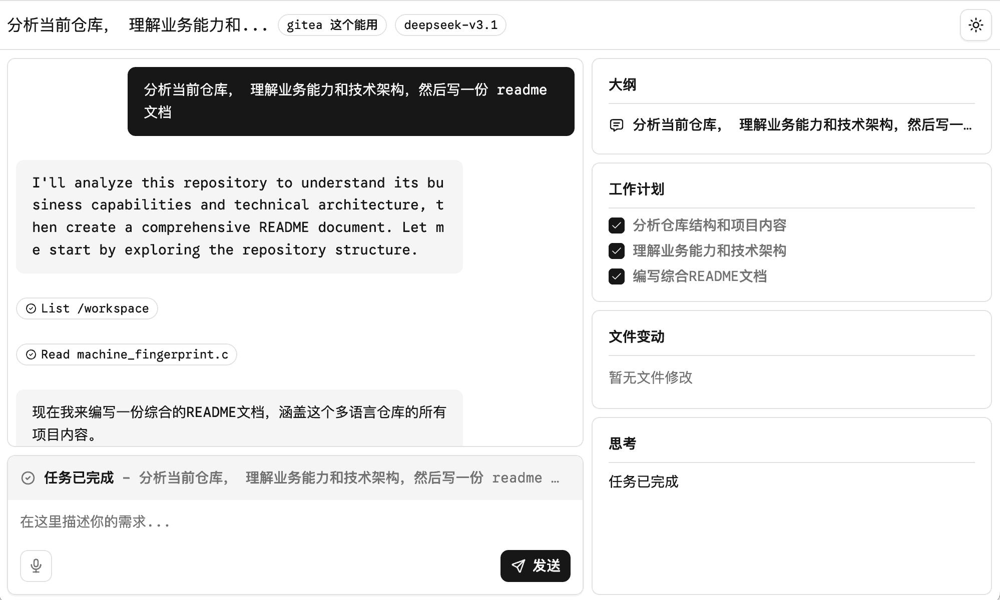
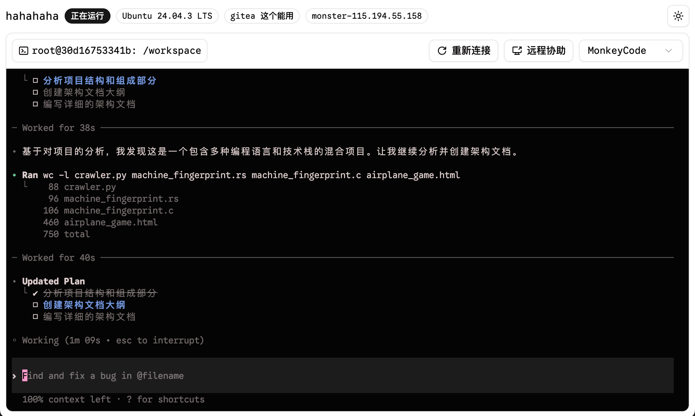
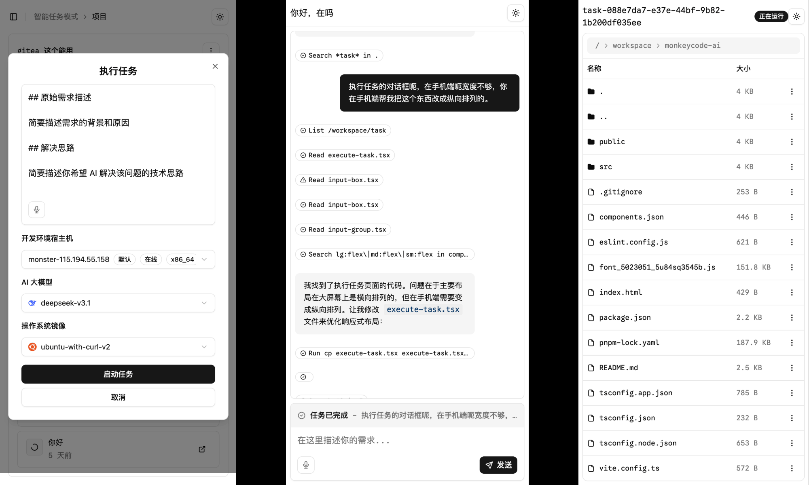

# MonkeyCode

<p align="center">
  
</p>

<p align="center">
  <a target="_blank" href="https://monkeycode-ai.com/">⚡ 在线使用</a> &nbsp; | &nbsp;
  <a target="_blank" href="https://monkeycode.docs.baizhi.cloud/">📖 帮助文档</a> &nbsp; | &nbsp;
  <a target="_blank" href="https://github.com/chaitin/MonkeyCode">🐙 GitHub</a>
</p>

## 👋 简介

**MonkeyCode** 是由长亭科技推出的企业级 AI 开发平台，覆盖 **需求 → 设计 → 开发 → 代码审查** 全流程。

MonkeyCode 不是简单的 AI 编程工具，而是对传统研发模式的变革，带来全新的 AI 编程体验，让研发团队效率 Max。你可以用自然语言描述需求，让 AI 帮你完成从需求分析、技术设计、代码开发到代码审查的完整开发流程。

## 💡 核心功能

### 智能任务

用自然语言描述需求，AI 自动完成开发、设计或代码审查。支持从 Git 仓库或 ZIP 文件导入代码，可选择开发工具和 AI 模型。

### 项目管理

关联 Git 仓库，管理项目需求和任务。可创建需求文档、启动设计任务和开发任务，实现需求驱动的开发流程。

### 在线开发环境

提供完整的在线开发环境，包括：

- **在线 IDE**：支持多语言高亮的代码编辑器
- **终端**：支持多会话的 Web 终端
- **文件管理**：在线浏览、编辑、上传下载文件
- **在线预览**：一键预览 Web 服务
- **远程协助**：支持与他人共享终端

### 代码审查

配置 Git 机器人，自动审查 GitHub/GitLab/Gitee 的 PR/MR，提供智能代码改进建议。

### 团队协作

企业管理员可以管理团队成员、分配资源（宿主机、镜像、AI 模型），实现权限控制和资源统一管理。

## 🚀 快速开始

本项目为 MonkeyCode **在线版** 前端，需配合后端服务使用。

```bash
# 进入前端目录
cd frontend

# 安装依赖
pnpm install

# 启动开发服务器
pnpm dev

# 构建生产版本
pnpm build
```

访问 http://localhost:5173 查看应用。

## 📖 使用文档

- **在线使用**：访问 [monkeycode-ai.com](https://monkeycode-ai.com/) 直接体验
- **帮助文档**：查看 [MonkeyCode 文档](https://monkeycode.docs.baizhi.cloud/) 了解团队版、点数说明、配置等
- **使用指南**：项目内详细操作说明见 [frontend/doc.md](./frontend/doc.md)

## ⚡ 界面展示

|  |  |
| --------------------------------------------------- | --------------------------------------------------- |
|  |                                                      |

## 🔗 相关链接

- [MonkeyCode 官网](https://monkeycode-ai.com/)
- [MonkeyCode 文档](https://monkeycode.docs.baizhi.cloud/)
- [长亭科技](https://chaitin.cn/)
- [长亭百智云](https://baizhi.cloud/)

## 💬 社区交流

欢迎加入我们的微信群进行交流。


## 🙋‍♂️ 贡献

欢迎提交 [Pull Request](https://github.com/chaitin/MonkeyCode/pulls) 或创建 [Issue](https://github.com/chaitin/MonkeyCode/issues) 来帮助改进项目。

## 📝 许可证

本项目采用 GNU Affero General Public License v3.0 (AGPL-3.0) 许可证。这意味着：

- 你可以自由使用、修改和分发本软件
- 你必须以相同的许可证开源你的修改
- 如果你通过网络提供服务，也必须开源你的代码
- 商业使用需要遵守相同的开源要求
